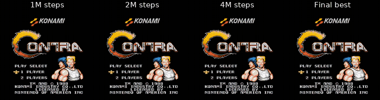

# 🎮 Contra-PPO: Reinforcement Learning Agent for Contra using PPO

[]()
[]()
[]()
[]()

A Reinforcement Learning project that trains an autonomous agent to play **Contra** using the **Proximal Policy Optimization (PPO)** algorithm. The project is built with **Gymnasium**, **PyTorch**, and **Stable-Baselines3**, providing a complete pipeline from environment creation, training, evaluation, and model visualization.

---

## 📌 Project Overview

Contra is a classic side-scrolling shooting game that requires the player to:

- Navigate through obstacles
- Avoid enemy attacks
- Defeat enemies
- Reach the end of each stage

Traditional rule-based AI struggles with such dynamic environments. Therefore, this project applies **Deep Reinforcement Learning (DRL)**, allowing an agent to learn optimal behaviors directly through interactions with the game.

The PPO algorithm is chosen because it provides stable learning, high sample efficiency, and strong performance in continuous optimization problems.

---

## 🎯 Objectives

- Build a custom Gymnasium environment for Contra.
- Train an RL agent using PPO.
- Design an effective reward function.
- Evaluate the trained model.
- Visualize agent performance.

---

## 🧠 Reinforcement Learning Framework

The agent follows the standard RL interaction loop:

```
Environment
      │
      ▼
 Observation
      │
      ▼
    PPO Agent
      │
      ▼
    Action
      │
      ▼
 Environment
      │
      ▼
Reward + Next State
```

The policy is optimized using **Proximal Policy Optimization (PPO)** from Stable-Baselines3.

---

## 📂 Project Structure

```
contra-PPO/
│
├── env/
│   ├── contra_env.py          # Custom Gymnasium environment
│   ├── wrappers.py
│   └── utils.py
│
├── models/
│   ├── best_model.zip
│   └── checkpoints/
│
├── train.py                   # PPO training
├── evaluate.py                # Model evaluation
├── play.py                    # Watch trained agent
│
├── requirements.txt
├── README.md
└── LICENSE
```

---

## ⚙️ Installation

Clone the repository

```bash
git clone https://github.com/pikamanh/contra-PPO.git
cd contra-PPO
```

Create a virtual environment

```bash
python -m venv venv
```

Activate it

Windows

```bash
venv\Scripts\activate
```

Linux / macOS

```bash
source venv/bin/activate
```

Install dependencies

```bash
pip install -r requirements.txt
```

---

## 🚀 Training

Start training the PPO agent

```bash
python train.py
```

The model checkpoints will be saved automatically.

---

## ▶️ Evaluation

Evaluate the trained model

```bash
python evaluate.py
```

Metrics include

- Average reward
- Episode length
- Success rate

---

## 🎥 Play with the Trained Agent

```bash
python play.py
```

The trained PPO agent will control the character automatically.

---

## 🏆 PPO Hyperparameters

| Parameter | Value |
|------------|--------|
| Algorithm | PPO |
| Policy | CNN / MLP |
| Learning Rate | 3e-4 |
| Gamma | 0.99 |
| GAE Lambda | 0.95 |
| Clip Range | 0.2 |
| Batch Size | 64 |
| n_steps | 2048 |
| Total Timesteps | Configurable |

---

## 🎯 Reward and Risk Design

`ContraEnv` combines progress, combat, survival, and terminal signals into one
scalar reward. Every raw component is summed and then divided by `10` before it
is returned to the agent.

### Reward signals

| Component | Trigger | Raw value | Returned contribution | Purpose |
|---|---|---:|---:|---|
| Progress | The player moves while alive and in the normal state | `clip(Δx - 0.5, -4, 3) + 1.5 * clip(new_progress, 0, 4)` | Raw value `/ 10` | Encourages local forward movement and gives an additional bonus for extending the furthest reached position. |
| Score | The score increases while the player is within 32 pixels of the progress frontier, or creates new progress | `0` or `+1` | `0` or `+0.1` | Rewards defeating an enemy or collecting a scoring item without allowing the agent to farm score far behind the frontier. |
| Dodge/survival | The player is alive in the normal state while at least one enemy is active | `+0.1` | `+0.01` | Provides a small incentive to survive and dodge; it is intentionally too small to make standing still profitable. |
| Boss defeated | The boss-defeated flag changes from false to true | `+120` once | `+12` once | Strongly rewards completing the main stage objective. |
| Stage over | The end-of-stage sequence starts | `+80` once | `+8` once | Rewards reaching the confirmed stage-completion sequence. |
| Level advance | The current level becomes greater than the previous level | `+50` | `+5` | Success signal for advancing to the next level. |

### Risk and penalty signals

| Risk event | Trigger | Raw value | Returned contribution | Effect |
|---|---|---:|---:|---|
| Backward/no useful movement | The progress formula becomes negative because local movement is insufficient | Down to `-4` | Down to `-0.4` | Discourages retreating and movement that does not compensate for the per-step progress threshold. |
| Death/life loss | The current life count is lower than on the previous step | `-15` | `-1.5` | Makes losing a life costly. No separate penalty is applied merely for taking non-lethal damage. |
| Stagnation | More than 90 stagnant steps outside the boss phase | From about `-0.017` down to `-2` | From about `-0.0017` down to `-0.2` | Increasingly penalizes standing still; it is disabled during the boss phase. |
| Game over | The game-over RAM flag is set | `-35` | `-3.5` | Terminal failure penalty. |

The environment currently treats risk as **negative reward**, rather than
returning a separate cost or risk signal. Therefore PPO optimizes the single
combined objective:

```text
reward = (progress + score + dodge + boss + terminal
          + life_penalty + stagnation_penalty) / 10
```

An episode ends on game over or when the Stage 1 boss completion state is
detected. Boss-phase stagnation is disabled because horizontal progress is no
longer a reliable objective during that encounter.

---

## 📈 Results

After training, the PPO agent is capable of:

- Navigating the map
- Avoiding enemy attacks
- Eliminating enemies
- Progressing through the level autonomously

Performance can be further improved through reward tuning and longer training.

### Training Progress Comparison

The following evaluation recordings show how the policy changes across
training checkpoints and compare them with the final best model selected by
the evaluation callback.



All four recordings start together. When a shorter recording ends, its final
frame remains visible until the final-best recording finishes at 32.8 seconds.

Original recordings: [1M steps](video/1_000_000_steps.mp4) ·
[2M steps](video/2_000_000_steps.mp4) ·
[4M steps](video/4_000_000_steps.mp4) ·
[final best weight](video/output_final.mp4)

This synchronized view provides a qualitative comparison of movement,
survival, combat, and level progression. Video length is included only as
recording metadata; use the evaluation metrics (mean reward, success rate, and
episode length) for a quantitative model comparison.

---

## 🛠 Technologies

- Python
- PyTorch
- Stable-Baselines3
- Gymnasium
- NumPy
- OpenCV
- Matplotlib

---

## 📚 References

- Schulman et al. (2017), **Proximal Policy Optimization Algorithms**
- Stable-Baselines3 Documentation
- Gymnasium Documentation
- OpenAI Reinforcement Learning Resources

---

## 👨‍💻 Author

**Minh Phuc, Manh Hung**

GitHub: https://github.com/pikamanh

---

## 📄 License

This project is intended for educational and research purposes.
